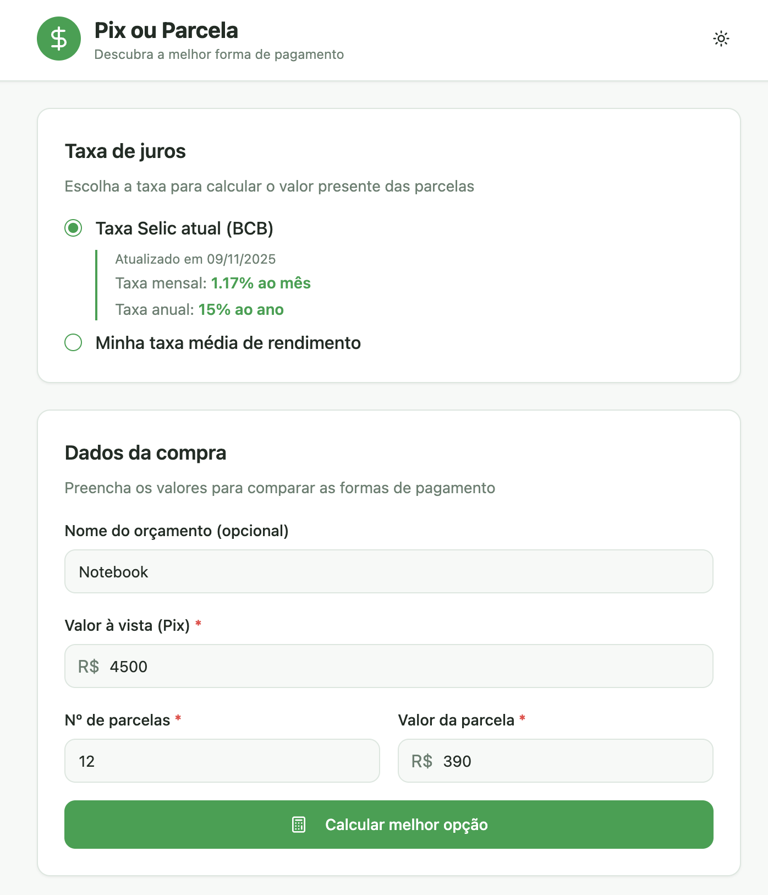
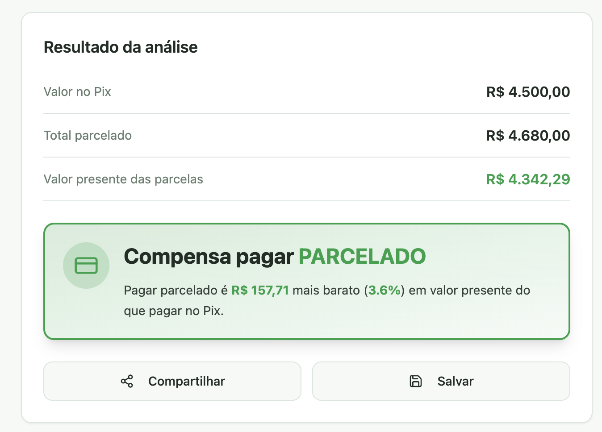

# Pix ou Parcela

**Descubra a melhor forma de pagamento**

Uma aplicação web que ajuda você a decidir entre pagar à vista (Pix) ou parcelado, calculando o valor presente das parcelas e comparando com o valor à vista.

## 📋 Sobre o Projeto

O **Pix ou Parcela** é uma ferramenta financeira que realiza cálculos de valor presente para comparar duas formas de pagamento:

- **Pagamento à vista (Pix)**: Valor total pago imediatamente
- **Pagamento parcelado**: Valor total dividido em parcelas mensais

A aplicação utiliza a taxa Selic atual do Banco Central do Brasil ou permite que você configure sua própria taxa de rendimento para calcular o valor presente das parcelas e determinar qual opção é mais vantajosa financeiramente.

## ✨ Funcionalidades

### 🎯 Cálculo Financeiro

- Comparação entre pagamento à vista (Pix) e parcelado
- Cálculo do valor presente das parcelas usando taxa de desconto
- Exibição da diferença nominal e percentual entre as opções
- Recomendação clara sobre qual forma de pagamento é mais vantajosa

### 📊 Taxa de Juros

- **Taxa Selic atual**: Consulta automática da taxa Selic diária através da API do Banco Central do Brasil
- **Taxa personalizada**: Permite configurar sua própria taxa média de rendimento anual
- Conversão automática entre taxas diárias, mensais e anuais

### 💾 Gerenciamento de Orçamentos

- Salvar cálculos realizados com nome personalizado
- Listar todos os orçamentos salvos
- Carregar orçamentos anteriores para edição e recálculo
- Excluir orçamentos salvos

### 📱 Compartilhamento

- Compartilhar resultados via WhatsApp (mobile)
- Copiar resultado para área de transferência (desktop)
- Formatação otimizada para compartilhamento

### 🎨 Interface Moderna

- Design responsivo para desktop e mobile
- Suporte a tema claro e escuro
- Interface intuitiva e fácil de usar
- Feedback visual claro sobre a melhor opção

## 🖼️ Screenshots

### Tela Principal - Formulário de Cálculo



A tela principal permite configurar a taxa de juros e preencher os dados da compra para realizar o cálculo.

### Resultado da Análise



A tela de resultado exibe uma comparação detalhada entre as opções de pagamento e recomenda a melhor escolha financeira.

## 🛠️ Tecnologias Utilizadas

### Frontend

- **React 18** - Biblioteca JavaScript para construção de interfaces
- **TypeScript** - Superset do JavaScript com tipagem estática
- **Vite** - Build tool e dev server rápido
- **React Router DOM** - Roteamento para aplicações React

### UI/UX

- **Tailwind CSS** - Framework CSS utility-first
- **shadcn/ui** - Componentes UI baseados em Radix UI
- **Radix UI** - Componentes acessíveis e customizáveis
- **Lucide React** - Biblioteca de ícones
- **next-themes** - Gerenciamento de temas (claro/escuro)

### Estado e Dados

- **TanStack Query (React Query)** - Gerenciamento de estado assíncrono e cache
- **LocalStorage** - Armazenamento local de orçamentos e configurações

### APIs Externas

- **API do Banco Central do Brasil** - Consulta da taxa Selic diária

### Outras Ferramentas

- **Zod** - Validação de schemas TypeScript
- **React Hook Form** - Gerenciamento de formulários
- **date-fns** - Manipulação de datas
- **PWA** - Suporte a Progressive Web App

## 🚀 Como Executar

### Pré-requisitos

- Node.js (versão 18 ou superior)
- npm ou yarn ou bun

### Instalação

1. Clone o repositório:

```bash
git clone <URL_DO_REPOSITORIO>
cd Pix-ou-Parcela
```

2. Instale as dependências:

```bash
npm install
# ou
yarn install
# ou
bun install
```

3. Inicie o servidor de desenvolvimento:

```bash
npm run dev
# ou
yarn dev
# ou
bun dev
```

4. Acesse a aplicação em `http://localhost:5173`

### Build para Produção

```bash
npm run build
# ou
yarn build
# ou
bun build
```

Os arquivos de produção serão gerados na pasta `dist/`.

## 📖 Como Usar

1. **Configure a taxa de juros**:

   - Escolha entre usar a taxa Selic atual (atualizada automaticamente do BCB) ou configure sua própria taxa média de rendimento

2. **Preencha os dados da compra**:

   - Nome do orçamento (opcional)
   - Valor à vista (Pix)
   - Número de parcelas
   - Valor de cada parcela

3. **Calcule**:

   - Clique em "Calcular melhor opção"
   - Veja o resultado comparando as duas formas de pagamento

4. **Salve e compartilhe**:
   - Salve o cálculo para consultar depois
   - Compartilhe o resultado via WhatsApp ou copie para área de transferência

## 📝 Estrutura do Projeto

```
Pix-ou-Parcela/
├── src/
│   ├── components/          # Componentes React
│   │   ├── FormularioCompra.tsx
│   │   ├── ResultadoCalculo.tsx
│   │   ├── TaxaSelector.tsx
│   │   ├── ListaOrcamentos.tsx
│   │   └── ui/              # Componentes UI do shadcn
│   ├── pages/               # Páginas da aplicação
│   │   ├── Index.tsx
│   │   └── NotFound.tsx
│   ├── utils/               # Utilitários
│   │   ├── calculos.ts      # Funções de cálculo financeiro
│   │   ├── bcb-api.ts       # Integração com API do BCB
│   │   └── storage.ts       # Gerenciamento de localStorage
│   ├── hooks/               # Custom hooks
│   └── lib/                 # Bibliotecas auxiliares
├── public/                  # Arquivos estáticos
└── package.json
```

## 🔧 Scripts Disponíveis

- `npm run dev` - Inicia o servidor de desenvolvimento
- `npm run build` - Cria build de produção
- `npm run preview` - Preview do build de produção
- `npm run lint` - Executa o linter

## 📄 Licença

Este projeto é de código aberto e está disponível sob a licença MIT.

## 🤝 Contribuindo

Contribuições são bem-vindas! Sinta-se à vontade para abrir issues ou pull requests.

---

## 🤖 Desenvolvimento

Este projeto foi desenvolvido totalmente por inteligência artificial, demonstrando as capacidades de desenvolvimento de software assistido por IA.

---

Desenvolvido com ❤️ para ajudar nas decisões financeiras do dia a dia.
